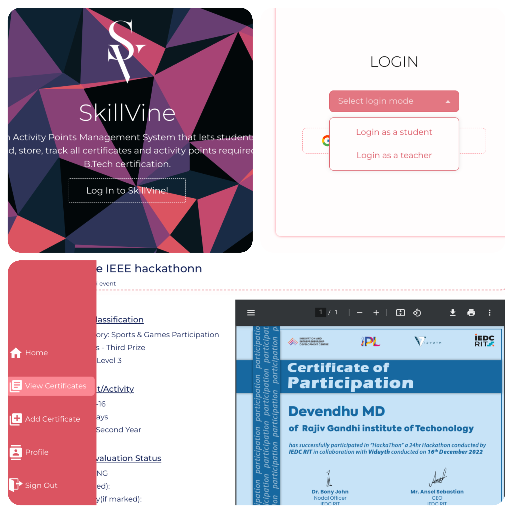
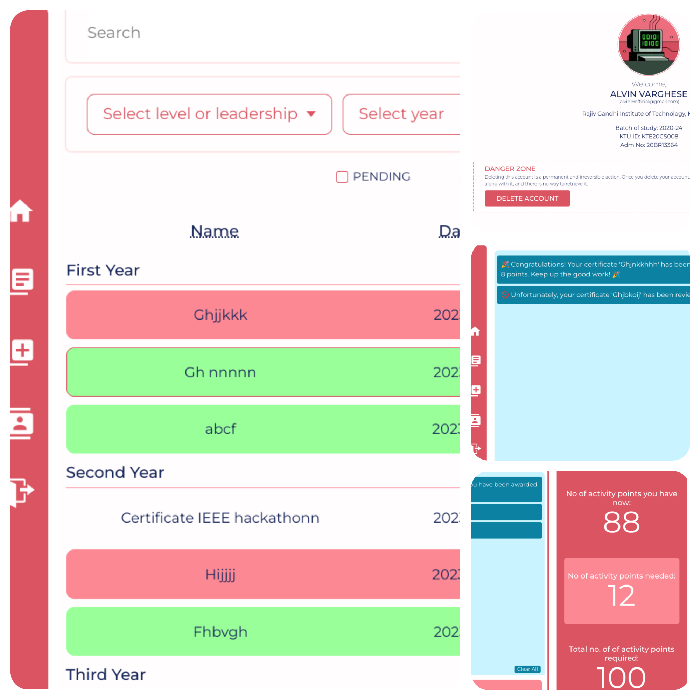
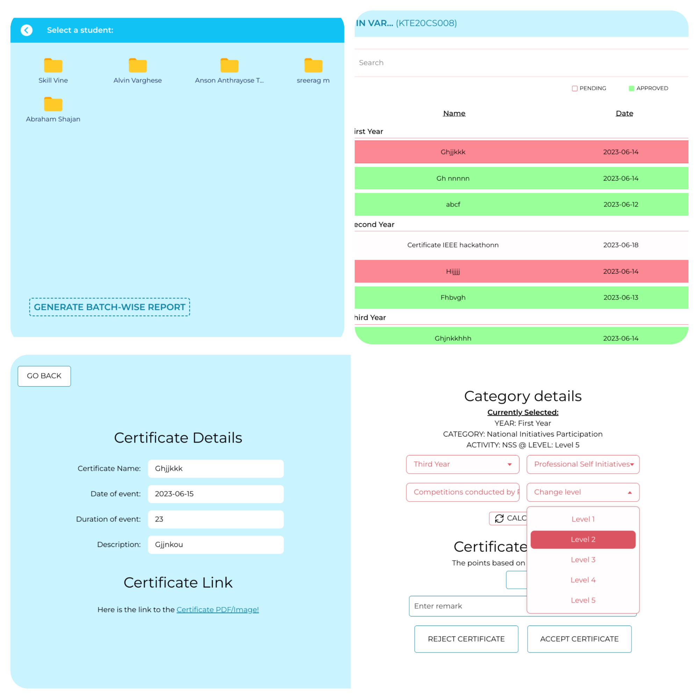
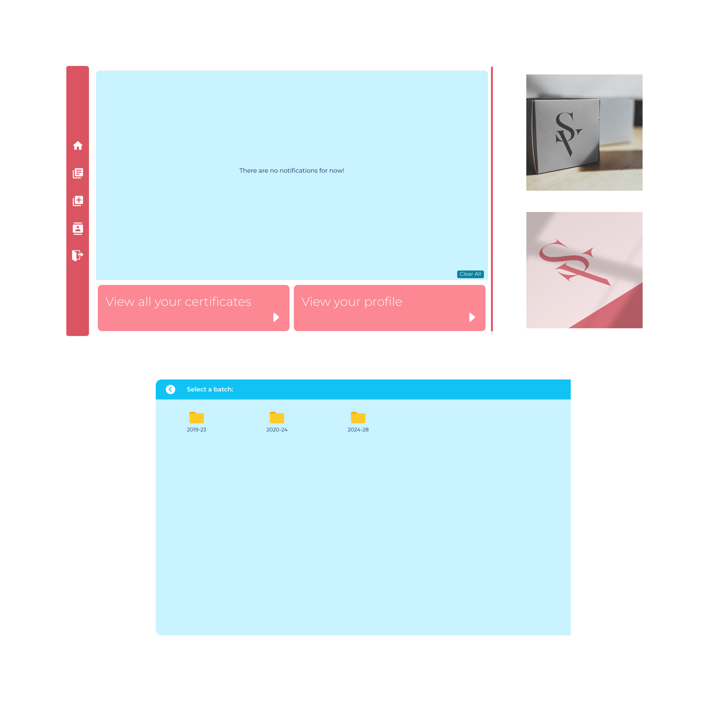

# :star: SkillVine

The Activity Points Management System is a web-based platform designed to simplify the process of managing certificates and tracking activity points for B.Tech certification. This documentation provides an overview of the system's features, installation instructions, and usage guidelines.

## TABLE OF CONTENTS

- [Important Links](#important-links)
- [Configuration for Local Deployment](#configuration-for-local-deployment)
- [Tech Stack](#tech-stack)
- [Usage and Features](#usage-and-features)
- [Contributors](#contributors)

## Important Links

- Visit live website @ https://skillvine.up.railway.app/
- Visit Client repo @ https://github.com/skillvine-rit/skillvine-client.git
- Visit API repo @ https://github.com/skillvine-rit/skillvine-api.git

## Configuration for Local Deployment

To deploy `SKILLVINE` on your local machine, follow these steps:

1. Clone the repository to your local machine
   `git clone git@github.com:skillvine-rit/skillvine-client.git`
   and cd into the directory.
2. Install the required dependencies. Make sure you have Node.js and npm (Node Package Manager) installed. Navigate to the project directory and run the following command: 
   `npm install`
3. Copy the `.env.example` file to `.env` and update the necessary values.
4. `npm run dev` to start the client at localhost:3000

## Tech Stack
We utilized the MERN Stack as the foundation of our application, encompassing the following frameworks and tools:

- `HTML, CSS & NEXT Js.` based on REACT Js. for front-end UI and Client-side logic
- `react-icons` for icons
- `axios`: This library facilitated HTTP requests and communication with the server.
- `jspdf` and `jspdf-autotable`: We utilized these libraries to generate PDF documents and tables within the application.
- `sharp`: We incorporated sharp for image processing and manipulation within our application.

## Usage and Features

Once the system is installed and running, users can follow these guidelines to utilize its features:

### For Students
- Log in using your institution email and credentials.
Upon logging in, you will be redirected to your personalized dashboard.
- To add a certificate, navigate to the "Add Certificate" section and use the provided interface to upload and save your certificates.
- Monitor your certificate points and track your progress and your profile details.
- In case of certificate rejection, review the remarks provided by the faculty, make necessary adjustments, and resubmit the certificate if required.
- If you wish to remove your account, navigate to the profile page and follow the provided instructions.

### For Teachers
- Log in using your credentials provided by the system administrator.
- Upon logging in, you will be redirected to your dashboard where you can select batch whose students' certificates you can evaluate.
- Access the certificate evaluation tools, where you can review, mark, and provide remarks for student certificates.
- Utilize the acceptance and rejection functionality to process student certificates based on the established evaluation criteria.
- Have the ability to remove student profiles if necessary.
- Generate batch-wise or student-wise reports to obtain a comprehensive overview of students' activity point statistics for each batch.

## Contributors

- [Alvin Varghese](https://github.com/alvin1904)
- [Anson Anthrayose Thomas](https://github.com/Anson369)
- [Vignesh R Pillai](https://github.com/vigneshacks)
- [Sreerag M](https://github.com/sm0483)
 
S6 CSE 
Govt. Engg. College (APJAKTU) 
Kottayam, Kerala, India 

